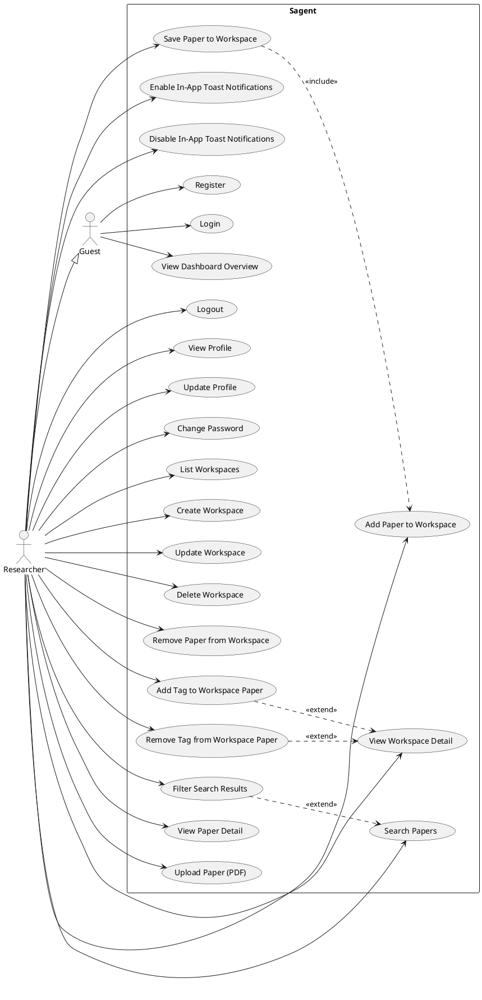

# Use-Case Diagram Support Document (Sagent)

This document provides the **inputs needed to draw a UML Use-Case Diagram** for the Sagent system: system boundary, actors, use cases, and common relationships (`<<include>>`, `<<extend>>`, generalization).

---

## System boundary

- **System name**: `Sagent (Web App)`
- **In scope**: UI + backend APIs used by the web app (authentication, workspaces, discovery, settings).
- **Out of scope** (outside the boundary):
  - External paper providers (e.g., arXiv / Semantic Scholar) unless your assignment requires modeling them as secondary actors
  - Email services
  - Browser/OS

---

## Actors

Actors represent **roles** that interact with Sagent.

- **Guest**
  - Not logged in (no token).
- **Researcher (Authenticated User)**
  - Logged in user (token exists and is valid).
- **External Paper Source** *(optional secondary actor)*
  - Represents external services used for paper discovery/search.
- **AI/Agent Service** *(optional secondary actor)*
  - Represents async “agent” tasks if you want to model them as an external system.

### Actor generalization (optional)

If you want to simplify the diagram, you can model:

- **Researcher** —|> **Guest**

Meaning: a Researcher can do everything a Guest can, plus more.

---

## Use cases (candidate list)

Use-case names should be **verb phrases**.

### Authentication & account

- **Register**
- **Login**
- **Logout**
- **View Profile**
- **Update Profile** (username/email/name)
- **Change Password**

### Dashboard

- **View Dashboard Overview**
  - Shows active workspaces/projects and activity overview.

### Workspaces

- **List Workspaces**
- **Create Workspace**
- **Update Workspace**
- **Delete Workspace**
- **View Workspace Detail**
- **Add Paper to Workspace**
- **Remove Paper from Workspace**
- **Add Tag to Workspace Paper**
- **Remove Tag from Workspace Paper**

### Paper discovery / library

- **Search Papers**
- **Filter Search Results**
- **View Paper Detail**
- **Upload Paper (PDF)**
- **Save Paper to Workspace**

> Note: “Save Paper to Workspace” and “Add Paper to Workspace” may be the same use case depending on your naming preference.

### Settings (toaster notifications)

These are **UI-level settings** (not backend-sent notifications).

- **Enable In-App Toast Notifications**
- **Disable In-App Toast Notifications**

---

## Actor → Use-case mapping

This section tells you which actor connects to which use cases in the diagram.

### Guest

- **Register**
- **Login**
- *(Optional, if your scope allows guests to browse)* **Search Papers**, **View Paper Detail**
- *(Optional)* **View Dashboard Overview** (read-only marketing dashboard)
- *(Optional)* **Enable/Disable In-App Toast Notifications** (local UI preference)

### Researcher (Authenticated User)

- **Logout**
- **View Profile**
- **Update Profile**
- **Change Password**
- **View Dashboard Overview**
- **Search Papers**
- **Filter Search Results**
- **View Paper Detail**
- **Upload Paper (PDF)**
- **Save Paper to Workspace**
- **List Workspaces**
- **Create Workspace**
- **Update Workspace**
- **Delete Workspace**
- **View Workspace Detail**
- **Add Paper to Workspace**
- **Remove Paper from Workspace**
- **Add Tag to Workspace Paper**
- **Remove Tag from Workspace Paper**
- **Enable/Disable In-App Toast Notifications**

---

## Use-case relationships

Use relationships only when they clarify the diagram.

### `<<include>>` (mandatory sub-flow)

Use `<<include>>` when one use case **always** requires another.

Common candidates:

- **Create Workspace** `<<include>>` **Validate Authentication**
- **List Workspaces** `<<include>>` **Validate Authentication**
- **Update Workspace** `<<include>>` **Validate Authentication**
- **Delete Workspace** `<<include>>` **Validate Authentication**
- **Save Paper to Workspace** `<<include>>` **Select Workspace**
- **Add Paper to Workspace** `<<include>>` **Validate Authentication**

> Many diagrams omit “Validate Authentication” and instead enforce access by connecting only the **Researcher** actor to protected use cases. Either approach is acceptable—pick one style and keep it consistent.

### `<<extend>>` (optional/conditional behavior)

Use `<<extend>>` when a behavior occurs **sometimes**.

Examples:

- **Filter Search Results** `<<extend>>` **Search Papers**
- **Prompt Login** `<<extend>>` *(any protected action)* when user is not authenticated
- **Add Tag to Workspace Paper** `<<extend>>` **View Workspace Detail**

### Generalization (use-case inheritance) *(optional)*

Only use if you have multiple “types” of the same behavior (often unnecessary for smaller projects).

---

## Mini use-case specifications (text you can paste into your report)

If your assignment needs textual use-case descriptions, use this template.

### Template

- **Name**
- **Primary actor**
- **Goal**
- **Preconditions**
- **Postconditions**
- **Main success scenario**
- **Extensions**

### Example: List Workspaces

- **Name**: List Workspaces
- **Primary actor**: Researcher
- **Goal**: View all workspaces owned by the logged-in user
- **Preconditions**: User is authenticated (valid token)
- **Postconditions**: Workspaces are shown to the user
- **Main success scenario**:
  - User navigates to Workspaces
  - System requests workspace list
  - System displays the list
- **Extensions**:
  - Token missing/invalid → System prompts login or redirects to login
  - Backend error → System shows error toast/message and allows retry

---

## Diagram checklist (quality + grading)

- Exactly **one system boundary box** labeled `Sagent`.
- Actors are **outside** the box; use cases are **inside**.
- Use cases are **verbs** (“Create Workspace”, not “Workspace Creation”).
- Do not include UI details (buttons, pages) in the diagram; keep those in textual specs.
- If the diagram gets crowded, split into two diagrams:
  - **Diagram A**: Authentication + Profile
  - **Diagram B**: Workspaces + Discovery + Settings

---

## Optional PlantUML template

If you’re allowed to submit PlantUML, you can start from this and adjust.

